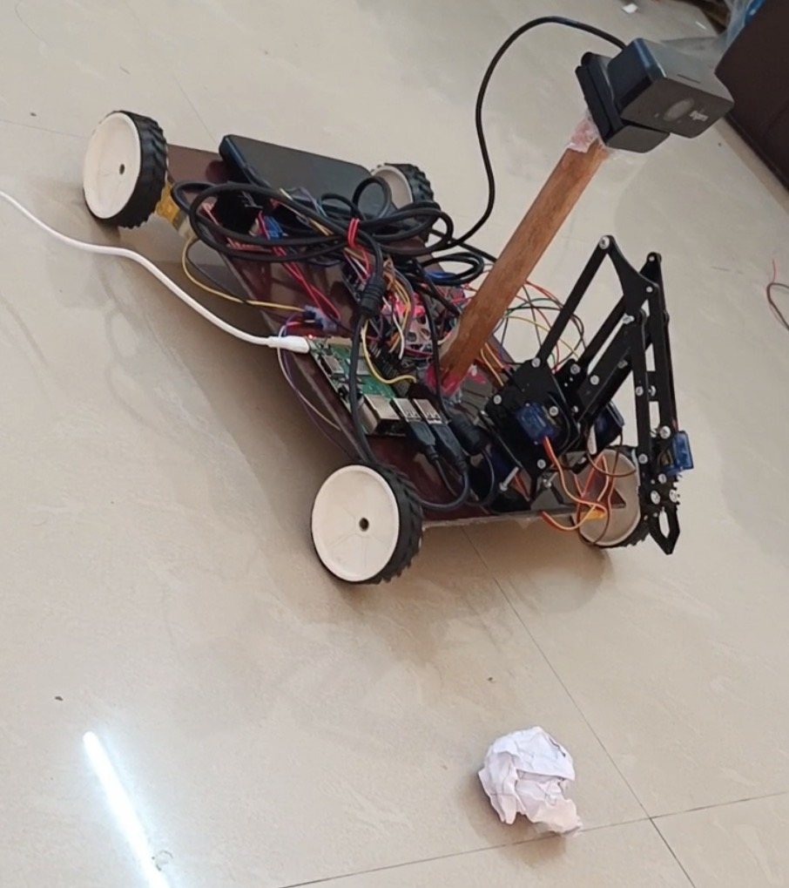

# Automatic Debris Removal Robot 

An autonomous robot that detects and removes debris without human intervention.

## Overview
Built using Raspberry Pi, Python and Computer Vision. The robot uses a camera to detect debris and autonomously navigates to pick it up using a robotic arm.

## Hardware Used
- Raspberry Pi
- USB Camera
- DC Motors + Motor Driver
- Robotic Arm (Servo Motors)
- Wheels and Chassis

## Software & Libraries
- Python 3
- OpenCV (Computer Vision)
- RPi.GPIO

## Features
- Autonomous debris detection using image processing
- Real-time navigation
- Robotic arm for debris collection
- Zero human intervention required

## Project Demo

## Developer
Soma Sekhar Vinnakota
Master's Student — Robotics & Industry 4.0
SRH University, Germany
